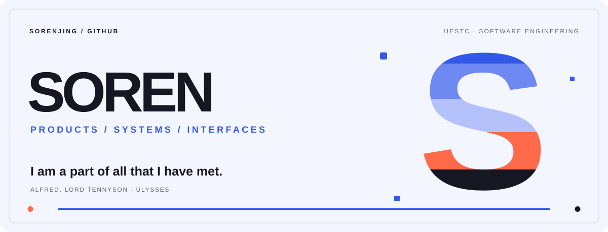

<picture>
  <source media="(prefers-color-scheme: dark)" srcset="./assets/profile-cover-dark.svg">
  <source media="(prefers-color-scheme: light)" srcset="./assets/profile-cover-light.svg">
  
</picture>

  <a href="https://github.com/sorenjing/EvolveTrace">EvolveTrace</a>
  &nbsp;·&nbsp;
  <a href="https://github.com/sorenjing/ai-context-kit">AI Context Kit</a>
  &nbsp;·&nbsp;
  <a href="https://github.com/sorenjing?tab=repositories">All repositories</a>

## Selected work

<table>
  <tr>
    <td width="50%" valign="top">
      <h3><a href="https://github.com/sorenjing/EvolveTrace">EvolveTrace ↗</a></h3>
      
Review what coding agents did—tasks, tool calls, permissions, changes, and verification—locally.

      
<code>Next.js</code> · <code>FastAPI</code> · <code>SQLite</code> · <code>SSE</code>

    </td>
    <td width="50%" valign="top">
      <h3><a href="https://github.com/sorenjing/ai-context-kit">AI Context Kit ↗</a></h3>
      
Keep Codex, Claude, Gemini, and Cursor aligned with one version-controlled project context.

      
<code>Python</code> · <code>CLI</code> · <code>Context engineering</code>

    </td>
  </tr>
</table>

## Experience

<table>
  <tr>
    <td width="50%"><strong>Xiaohongshu</strong></td>
    <td>Product Engineer Intern (PE)</td>
  </tr>
  <tr>
    <td><strong>Tencent Music Entertainment</strong></td>
    <td>Frontend Engineer Intern</td>
  </tr>
</table>
