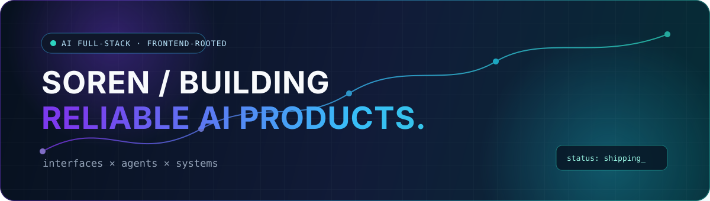

<div align="center">



<br />

[](https://github.com/sorenjing)
[](https://github.com/sorenjing)
[](https://github.com/sorenjing)

**Software Engineering @ UESTC · Building reliable products and developer tools for the AI era**

</div>

---

## `whoami`

I'm **Soren**, a software engineering student and product engineer with production frontend experience, now building **AI-powered products and developer tools**.

我不是简单地从前端切换到另一个岗位标签，而是在把成熟的前端与软件工程能力延伸到 AI 产品：关注真实用户问题、产品体验、系统可靠性，以及 AI 如何改变软件的构建方式。

```ts
const soren = {
  focus: ["Product Engineering", "AI Applications", "Developer Tools"],
  foundation: ["TypeScript", "Frontend Systems", "Product Craft"],
  building: "Useful, reliable products for the AI era",
  toolkit: {
    interfaces: ["React", "Vue", "Next.js"],
    services: ["Node.js", "FastAPI", "Python", "SQLite"],
    ai: ["LLM Applications", "MCP", "Context Engineering", "Evaluation"],
    engineering: ["SSR", "Rspack", "Docker", "CI/CD"],
  },
};
```

## Featured systems

<table>
<tr>
<td width="50%" valign="top">

### [EvolveTrace](https://github.com/sorenjing/EvolveTrace)

**Local review & observability workspace for coding agents**

把 Coding Agent 的任务、工具调用、权限、修改与验证事件，整理成可审查的工程记录。

`Next.js` · `FastAPI` · `SQLite` · `SSE` · `Codex Hooks`

- 实时 Agent 执行轨迹
- 确定性风险识别与证据审查
- 本地优先、敏感数据脱敏
- 可复制的修正提示与演示数据

[View repository →](https://github.com/sorenjing/EvolveTrace)

</td>
<td width="50%" valign="top">

### [AI Context Kit](https://github.com/sorenjing/ai-context-kit)

**One shared memory layer for every AI coding tool**

让 Codex、Claude、Gemini 与 Cursor 在同一工作区共享可靠、可版本控制的项目上下文。

`Python` · `CLI` · `Context Engineering` · `Codex Skill`

- 多项目发现与增量刷新
- 自动事实与人工语义记忆分离
- 离线优先，无模型 API 与云服务
- 安全失败、隐私边界与 CI 验证

[View repository →](https://github.com/sorenjing/ai-context-kit)

</td>
</tr>
</table>

## Experience

<table>
<tr>
<td width="50%" valign="top">

### Xiaohongshu

**Product Engineer Intern (PE)**

Frontend-focused product engineering for large-scale web systems, AI engineering tools, internationalization and SSR reliability.

</td>
<td width="50%" valign="top">

### Tencent Music Entertainment

**Frontend Engineer Intern**

Building user-facing products with modern frontend engineering.

</td>
</tr>
</table>

## Engineering focus

```text
Product thinking   ──→  Useful AI experiences
Frontend systems  ──→  Interface & product craft
Node / Python     ──→  Services & developer tools
Reliability       ──→  Observable, dependable software
```

- **Product engineering** — 从用户问题出发，跨越界面、服务与工程系统完成交付
- **AI applications** — 上下文工程、结构化输出、评测、容错与人机协作体验
- **Developer tools** — Coding Agent 可观测性、共享上下文与本地优先工具
- **Production engineering** — SSR、性能、国际化、CI/CD、降级与可靠性设计

## Selected stack

<div align="center">


</div>

## What I'm building toward

> **Product-minded, engineering-driven, AI-oriented.**

我希望构建能解决真实问题的产品，而不只是追逐新的技术标签：让 AI 能力真正可用，让复杂系统保持清晰、可靠，并持续从用户反馈中改进。

<div align="center">

[](https://github.com/sorenjing?tab=repositories)

<sub>Keep learning. Keep building.</sub>

</div>
